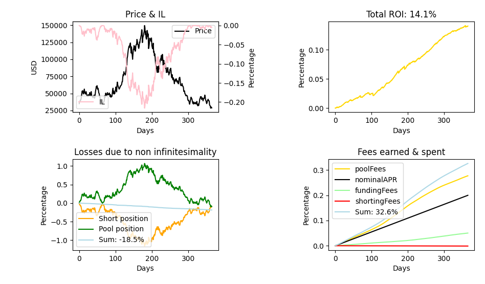
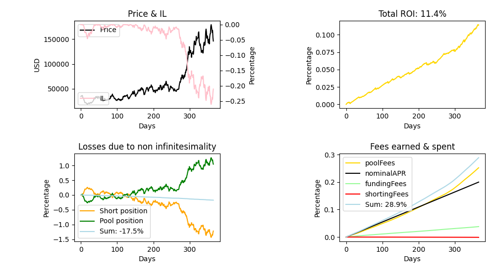
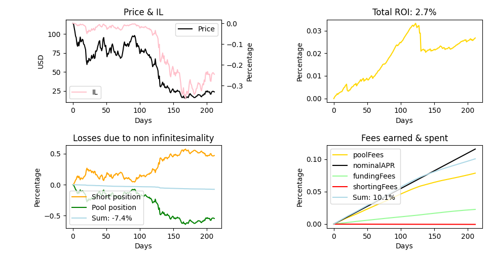

# On uniswap delta neutral farming

This python project aims to build, analyze, benchmark, and run a delta neutral farming strategy on UniswapV2 and similar forks.

## Motivation

For several months now, UniswapV2 forks have been multiplying, promising liquidity providers increasingly large APYs. Would it be possible to take advantage of these high APYs, without taking risks?

## The strategy

In this document, I will focus on USD/token pools. The idea is to benefit from liquidity provider APYs while being delta neutral, that is not being exposed to the market.
So having provided a unit of liquidity (= 1 USDT/Stablecoin + the equivalent of 1 USD in the form of another token T), how can we be delta neutral? The first idea is to short 1 USD of T. But as a liquidity provider, our exposure to the market depends on the price of the underlying asset T.
Indeed, with
$Q_s$ the amount of stablecoins S in the pool,
$Q_t$ the amount of token T in the pool,
$P$ the price of a token T in stablecoin S. 
We have the following (cf UniswapV2 [whitepaper](https://uniswap.org/whitepaper.pdf)):
$Q_s * Q_t = k$ with $k$ constant and
$P = Q_s / Q_t$.
Those equations hold with $Qs$ and $Qt$ being the amount redeemable by a single liquidity provider (with, of course, another $k$).\
We can solve for $Q_t$ and $Q_s$:
$\boxed{Q_t = \sqrt{\frac{k}{P}}}$ and 
$\boxed{Q_s = \sqrt{k*P}}$.\
Thus, by shorting the non-constant amount $\sqrt{\frac{k}{P}}$ of token T we become market neutral, while profiting from fees.
<h3>Proof</h3>
We enter the pool a time $t$ with a quantity $Q_s(t)$ of stablecoin $S$ and $Q_t(t)$ of token $T$, at a price $P(t)$.\
At the same time, we open a short position  of $q_{short}=\sqrt{\frac{k}{P(t)}}$ tokens T at price $P(t)$.
The porefolio value in dollars at a time $\tau$ is $\Lambda(\tau) = \rho(\tau) + \chi(\tau)$ with $\rho(\tau) = Q_t(\tau)P(\tau) + Q_s(\tau)$ the value in dollars of the pool position and  $\chi(\tau) =q_{short}(2P(t) -P(\tau))$ the value in dollars of the short position. Let a unit of time pass.
$$P(t+1) = P(t) + dP$$
Then, to the first oder:
$$Q_s(t+1)  = \sqrt{kP(t+1)} = \sqrt{k(P(t) + dP)} =Q_s(t) * \sqrt{1 + \frac{dP}{P(t)}} \simeq Q_s(t) * (1 + \frac{1}{2}\frac{dP}{P(t)}) \implies \boxed{dQ_s = \frac{1}{2} dP\sqrt{\frac{k}{P(t)}}}$$
And we also have
$$Q_t(t+1) = (\frac{Q_s(t)+dQ_s}{P(t)})  \frac{1}{1+\frac{dP}{P(t)}}\simeq (Q_t(t)+ \frac{dQ_s}{P(t)}) * (1 - \frac{dP}{P(t)})\simeq Q_t(t) + \frac{dQ_s - Q_t(t)dP}{P(t)} \implies \boxed{dQ_t = - \frac{1}{2}\frac{dP\sqrt{\frac{k}{P(t)}}}{P(t)}}$$
Let's compute our benefit to the first order (without considering any fees):
$$\varepsilon = \Lambda(t+1) - \Lambda(t) = \rho(t+1) - \rho(t) + \chi(t+1) - \chi(t) = \varepsilon_{\rho} - \varepsilon_{\chi}$$
$$\varepsilon_{\rho} = (Q_t(t)+dQ_t)(P(t)+dP) - Q_t(t)P(t)+ dQ_s\simeq Q_t(t)dP + P(t)dQ_t + dQ_s =dP\sqrt{\frac{k}{P(t)}}$$
In the same manner, we find :
$$\varepsilon_{\chi} =-dP\sqrt{\frac{k}{P(t)}} = -\varepsilon_{\rho} $$
$$\boxed{\varepsilon_{} = 0 } \text{ to the first order.}$$

By closing the short position, we find ourselves in the same context as when we started, and can reiterate. This strategy is indeed market neutral, and while not losing money due to market exposure we are able to collect pool fees and funding rate fees if positive (which is often the case on crypto assets!)

## Implementation

To benchmark this strategy, I implemented it in python (`pool.py`). It is possible to use two types of benchmarking: a benchmark on mathematically generated prices, and a benchmark on real historical data. Price variation at each time step are modelized by a normal distribution with a set standard deviation (the "volatility"). To run a simulation on generated prices, one must create a Portfolio object with the value of APR and fundingRate by time step to be benchmark, with mode=0. Then one must call `simulation()` method of the PF object with the number of time step, and how often should the short position be rebalanced. For the historical data simulation, one must first gather the prices data using `getPriceHistorical()` with currency, start date and end date as parameters before using it on the creation of the PF object with mode=1 this time.
mode=2 is used for an actual implementation of this strategy in rela time using Binance API. NOTE: API changed, the functions of the bot need to be re implemented in `bot.py`\
Please see examples at the end of `pool.py`.

## Results

### Simulated prices

After playing with the parameters (I won't do a statistical analysis of their impact), we notice that the most important parameter is the volatility of the underlying asset. It is understandable because volatility directly impact the validity of our infinitesimal calculus - costing us a non negligeable amount of money. 

With a low daily volatility we obtain great results (pool APR = 20%, fundings rates APR = 8%)

IL in pink is the Impermanent loss, in % (loss linked to providing liquidity in the pool VS just holding). Here, with close to no IL, rebalancing the short cost us only 15.3% which is greatly under our benefits (20+8 - shorting fees = 25%). So we obtain a great ROI YoY.

This results hold with a higher IL showing that the strategy is indeed really market neutral:

As said, if the volatility of the underlying asset increases, the strategy becomes unprofitable. The relative error of our calculus become too important to be absorbed by the profits:

### Historical prices

We will try to confirm those observations against reality.
First, let's benchmark the startegy on a relative low-volatility asset such as BTC on the two 8 months of 2022 with the same APR (pool & funding rates):

9.2% ROI an 8 month which is around 14% YoY. This is extremely satisfying but we need to take in consideration that finding a 20% APR pool on BTC/USDC might be really specific/hard. Moreover, the APR of a pool is varying during the year. Note: I made this program in march and tested BTC ROI for the 2 first month of 2022 (around 2.1%). This benchmark is thus really fair and works on real market conditions, even during a big krash.

What about a more volatile asset such as AVAX?

It is still profitable!

## Conclusion & Openings

This strategy proves to be profitable. We need to find an asset highly traded to have great pool APRs, with a small dilution so it's not too shorted and funding rates are positive (and interesting), and which is not too volatile. We could try to benchmark a list of asset using real APRs data from Uniswap/TraderJoe for example - which was not done here.

Also, the ROI graph can be misleading: the program is not closing the short position at each time step but only rebalancing the position (adding/closing small amounts instead of full close then full open) to optimize exchange fees (that depend on order size). So even if the graph went negative, it doesn't mean that the strategy was unprofitable at a time because the short position was not close, and previous short gains were not TPed.

Finally we may focus on token/token pools. There might be interesting positively correlated pairs where the pools is thus less exposed to market movements and so volatility matters less. Furthermore, having two shorts implies the earning of two funding rates fees.
